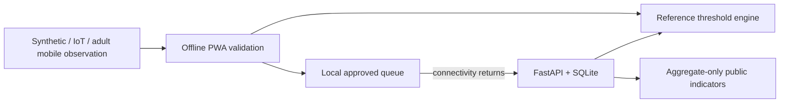
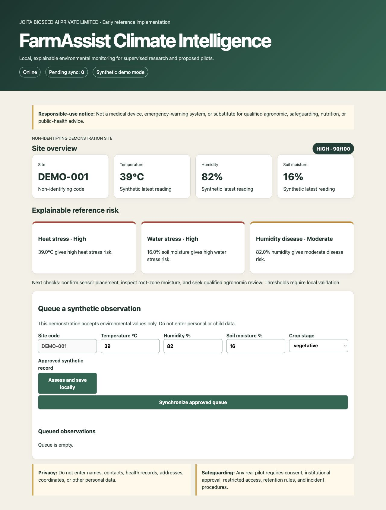

# FarmAssist Child Climate & Nutrition Intelligence

[](https://github.com/prakau/farmassist-child-climate-open/actions/workflows/ci.yml)
[](https://github.com/prakau/farmassist-child-climate-open/actions/workflows/secret-scan.yml)

**Reviewer links:** [Launch the public synthetic demo](https://prakau.github.io/farmassist-child-climate-open/) · [Live project brief](https://farmassist-climate-open.algalomics.chatgpt.site) · [Website source](https://github.com/prakau/farmassist-child-climate-open-website) · [Release notes](RELEASE_NOTES.md)

> **FarmAssist Child Climate & Nutrition Intelligence is an early open-source reference implementation intended for supervised research and pilot deployment. It is not a medical device, emergency-warning system or substitute for qualified agronomic, safeguarding, nutrition or public-health advice.**

An offline-first environmental monitoring reference platform designed to support school gardens, community nutrition gardens, and vulnerable smallholder settings. It records non-personal temperature, humidity, soil-moisture, and crop-stage observations; explains configurable risk thresholds locally; queues approved records while offline; and publishes aggregates only.

The UNICEF-specific child-impact concept has **not** been validated. The software does not claim to improve nutrition or health. Independent agronomic, safeguarding, usability, and impact evaluation is required before operational use.

## Problem and intended public benefit

Intermittent connectivity can prevent timely environmental monitoring. This prototype demonstrates a transparent local workflow for implementers, adult garden supervisors, researchers, and qualified agronomists. Children must not be profiled or made responsible for responding to alerts.

## Architecture



See [architecture](docs/architecture.md), [offline design](docs/offline-first-design.md), and [API reference](docs/api-reference.md).

## Quick start

Prerequisites: Python 3.12+, Node.js 20+, npm, and GNU Make.

```bash
make install
make test
make run
```

`make run` serves the API at http://localhost:8000 (OpenAPI: `/docs`) and the dashboard at http://localhost:5173. Or run `docker compose up --build`.

Example:

```bash
curl http://localhost:8000/health
curl -X POST http://localhost:8000/v1/risk/assess \
  -H 'Content-Type: application/json' \
  --data @examples/observation.json
```

## Offline workflow

The installable PWA caches its shell. Approved synthetic observations are stored in browser local storage when offline, remain reviewable, and synchronize on request after reconnection. UUIDs and API conflict responses prevent duplicate insertion. This demonstration does not encrypt browser storage and is not approved for sensitive data.

## Demonstration

Run `python scripts/generate_synthetic_data.py` to regenerate 360 clearly labelled records across `DEMO-001`, `DEMO-002`, and `DEMO-003`.

**[Launch the browser-based public demonstration](https://prakau.github.io/farmassist-child-climate-open/).** It operates entirely with synthetic values. Its final synchronization acknowledgement is simulated locally and transmits no record; run the repository locally to exercise the FastAPI ingestion endpoint.



- [Watch the 36-second offline assessment and synchronization demonstration](docs/assets/offline-risk-sync-demo.mp4).
- [Inspect the FastAPI OpenAPI screenshot](docs/assets/api-openapi-docs.jpg).
- Read the [prototype-evidence notes](docs/prototype-evidence.md) for capture provenance and limitations.
- Read [Prototype and field-work evidence](PILOT_EVIDENCE.md) for a strict separation between completed JOITA work and proposed future validation.

## Repository map

| Path | Purpose |
|---|---|
| `apps/api` | FastAPI and SQLite service |
| `apps/dashboard` | TypeScript offline PWA |
| `packages/risk_engine` | Human-readable thresholds and explanations |
| `schemas` | Interoperable JSON Schema |
| `data/synthetic` | Generated non-personal demonstration data |
| `docs` | Safety, governance, deployment, and evaluation guidance |
| `tests` | Schema, engine, API, privacy, and generator tests |

## Safeguarding and governance

This repository never requests child names, health records, biometrics, phone numbers, addresses, exact coordinates, school-child identities, or farmer identities. Any real pilot requires informed consent, child-safeguarding review, institutional approval, data-minimization review, role-based access, retention rules, incident reporting, and appropriate agronomic and implementation partners. Read [safeguarding](docs/safeguarding.md), [data governance](docs/data-governance.md), and the [privacy threat model](docs/privacy-threat-model.md).

## Limitations

- Thresholds are illustrative, not crop-, region-, or sensor-validated.
- Synthetic data cannot establish field performance, accuracy, usability, impact, or fairness.
- SQLite and local storage suit demonstrations, not an approved production deployment.
- No active school pilot, UNICEF endorsement, funding, or partnership is claimed.
- Operational security, localization, accessibility, hardware calibration, and independent review remain future work.

## Roadmap and indicators

The [12-month roadmap](ROADMAP.md) covers architecture through a proposed stable release. The design supports observation count, offline-processing share, synchronization success, latency, active site count, completeness, high-risk periods, aggregate trainees, future alert-interpretation usability, and connected uptime. No current indicator values are claimed.

## Open source

Software is MIT licensed. Documentation, synthetic data, and non-code content are CC BY 4.0. Future reference hardware may use CERN-OHL-S. See [contributing](CONTRIBUTING.md), [governance](GOVERNANCE.md), and [security](SECURITY.md).

**Organisation:** JOITA BIOSEED AI PRIVATE LIMITED · India  
**Project lead:** Dr. Meenakshi Sharma  
**Contact:** joitabioseedai@gmail.com · [joitabioseedai.com](https://www.joitabioseedai.com/)
