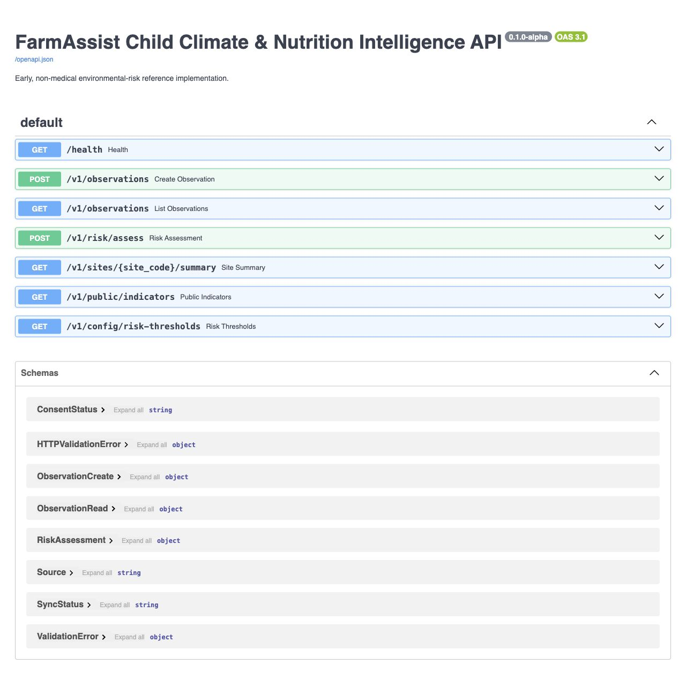

# Prototype demonstration evidence

The assets in `docs/assets` were captured from the functioning `v0.1.0-alpha` repository on 29 July 2026. They contain synthetic environmental observations only.

## Dashboard screenshot

The dashboard capture shows:

- the non-identifying site code `DEMO-001`;
- synthetic temperature, humidity, and soil-moisture values;
- locally calculated heat, water, and humidity risk levels;
- a combined score generated from the public reference thresholds;
- offline queue and synchronization controls;
- visible responsible-use, privacy, and safeguarding notices.

## Offline-to-synchronization demonstration

[Watch the 36-second MP4 demonstration](assets/offline-risk-sync-demo.mp4).

The browser sequence records these observable states:

1. the dashboard online with an empty queue;
2. offline demonstration mode enabled;
3. a synthetic observation of 41°C, 90% humidity, and 14% soil moisture assessed locally and queued;
4. a synchronization attempt refused while offline, leaving the record on-device;
5. connectivity restored with one approved record pending; and
6. successful synchronization to the locally running FastAPI endpoint, returning the queue to zero.

The public GitHub Pages demonstration uses the same interface but simulates the final acknowledgement locally and states that no record is transmitted. This keeps the public demonstration non-personal and server-free. The repository's local run path exercises the real `POST /v1/observations` endpoint.

## OpenAPI screenshot

The API capture shows the implemented health, observation, risk-assessment, site-summary, aggregate public-indicator, and risk-configuration endpoints.

## Limits

These assets prove software behavior and reproducibility only. They do not establish field accuracy, agronomic validity, sensor performance, usability, nutrition outcomes, child-health outcomes, or pilot impact. All values shown are synthetic, all site identifiers are non-identifying, and the reference thresholds require independent local validation.
